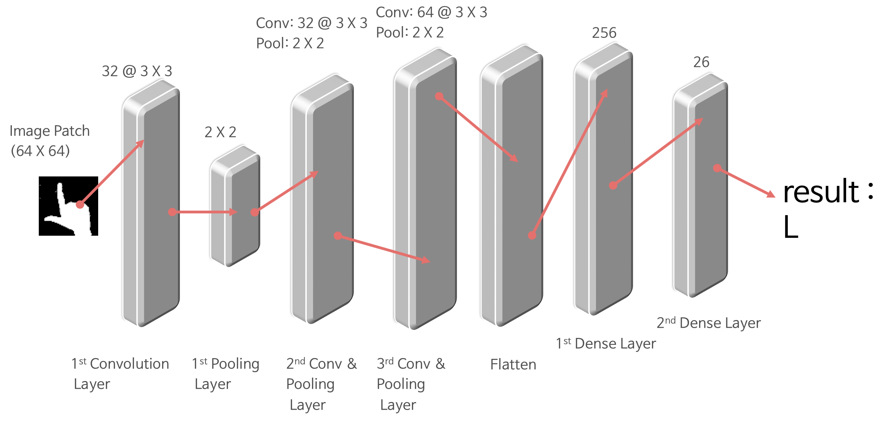

[](http://hits.dwyl.io/chrisais9/chrisais9/EasyHandy)

<h1 align="center">
  <br>
  </a>
  <br>
  Easy Handy
  <br>
</h1>

<h4 align="center">🎰Learn sign languge easily! 🚀</h4>


## What is EasyHandy?
Pyqt5 + OpenCV + CNN Deep Learning 을 활용  
  
듣지못하는 청각 장애인 분들과 소통 하는 방법중 가장 대표적인 수화 🤙.  
직접 동영상을 시청하며 수화를 배울수 있으며, 당신의 손 모양이 올바른지 딥러닝으로 인식해줍니다!

## UI 설명


## 딥러닝 모델 (CNN 알고리즘)


## 보고서
다음은 보고서 입니다. 프로그램에 대한 전반적인 설계와 명세가 들어가 있습니다.

- 소프트웨어 구조 설계서(ADS).pdf
- 소프트웨어 상세 설계서(DDS).pdf
- 요구 사항 명세서(SRS).pdf
- 테스트보고서.pdf

[보고서](보고서)

## How to Run?

1. install following libraries.
2. Run LearnActivity.py!

## Install List

- Python `3.7.0`
- OpenCV `3.4.2.16`
- pyqt5
- tensorflow
- keras
- scipy
- qimage2ndarray
- keras
- pillow

> 💡 **NOTE: you must install OpenCV `3.4.2.16` due to some functions deprecated in latest version.**
  ```
  Installing opencv for python with the following commands

  pip install opencv-python==3.4.2.16

  pip install opencv-contrib-python==3.4.2.16
  ```


