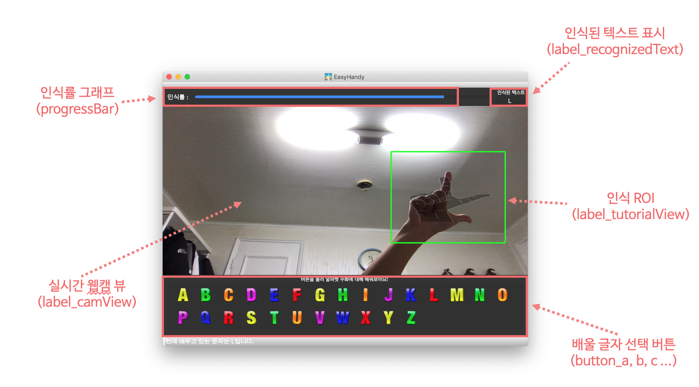

# 소프트웨어 구조 설계서(ADS)

## 1. 전체 인프라 다이어그램

  
- **Keras** 를 이용하여 딥러닝 모델(CNN) 구축
- 수화를 인식 시키키위한 학습 데이터는 **Sign Langage DataSet** 이용
- Pyqt GUI 에서는 이미지를 **OpenCV를 활용하여 전처리**를 한후 이를 딥러닝 모델에 Feed 해줌
- 딥러닝 모델은 이를 분석 헤서 다시 메인 GUI 에 넘겨줌

## 2. 클래스 다이어그램

  
- **LearnActivity** 는 QMainWindow를 상속받으며 **메인 GUI와 로직**을 담당함.
- **Predicator** 는 LearnActivity 와 **Dependency 를 가지지 않으며** Image 를 읽어 들여 수화 **제스쳐를 인식**하는 역할을 함
- **ProgressThread** 는 인식률을 보여주는 ProgressBar 로직을 처리함
- **Image**는 단순 독립적인 png 이미지 파일로서 **LearnActivity.saveToPredicator()** 함수가 이를 저장 하고 **Predicator** 이를 인식함.

## 2.1. 클래스 명세

| 클래스ID 	|   클래스 이름  	|                                                                                                              설명 	|
|----------	|:--------------:	|------------------------------------------------------------------------------------------------------------------:	|
| CL-01    	|  LearnActivity 	|                                     PyQt의 UI, 프로그램의 메인로직을 담당한다.                                    	|
| CL-02    	| ProgressThread 	|                      쓰레드로 동작하며, Progressbar의 로직을 담당한다. Progressbar는 수화의 인식률 표시에 쓰인다. 	|
| CL-03    	|   Predicator   	| 수화 인식 로직을 담당하며, 수화 데이터셋을 CNN 딥러닝 모델에 트레이닝 시킨 Classifier Model 을 기반으로 동작한다. 	|

## 2.2. 클래스별 내부 함수 명세

### 2.2.1 LearnActivity

UI, 프로그램의 메인로직을 담당한다.

| 함수 이름                   	| 역할                                                                                                                                                                      	|
|-----------------------------	|---------------------------------------------------------------------------------------------------------------------------------------------------------------------------	|
| playProgress()              	| View 에 수화 인식률을 표시해주는 로직을 담당하는 ProgressThread 객체를 선언해주며, ProgressBar 의 값이 변경될때마다 onCountChanged() 함수를 호출해준다.                   	|
| onCountChanged()            	| 매개변수 값으로 넘어온 값을 View 내에 존재하는 progressBar에 반영해주며, ProgressBar 가 100%이면 showDoneTutorial()을 호출해 인식을 성공했다는 이미지를 띄워준다.         	|
| showDoneTutorial()          	| 인식이 완료되었고 다른 알파벳 버튼을 누르도록 유도하는 이미지를 View 에 띄워준다.                                                                                         	|
| hideDoneTutorial()          	| 인식 완료 이미지를 Hide 해준다.                                                                                                                                           	|
| setTutorialButton()         	| 각 알파벳 버튼 객체를 등록해주며, 버튼 이미지를 설정하고, 버튼이 눌릴때 콜백함수를 등록한다.                                                                              	|
| alphabetButtonCliked()      	| 알파벳 버튼이 눌렸을때 동작하며, notifyModeChanged() 함수에 눌린버튼의 알파벳을 매개변수로 넘긴다.                                                                        	|
| notifyModeChanged()         	| 인식해야하는 알파벳 모드가 바뀌었을때 호출되며 Status바에 현재 모드를 알려주고, loadTutorialImageFromMode() 함수를 호출한다.                                              	|
| loadTutorialImageFromMode() 	| 웹캠 View 에 수화이미지를 Overlay 하여 사용자가 쉽게 수화를 따라 할 수 있도록 한다.                                                                                       	|
| videoToFrame()              	| 웹캠에서 받아온 원본 이미지를 View에 표시하는 역할을 하며, 따로 ROI 내에 존재하는 이미지를 Crop 하여 SaveToPredictor() 함수에 넘겨준다.                                   	|
| SaveToPredictor()           	| 이미지를 손의 색상 HSV(Hue-Saturation-Value) 값을 기반으로 이진화 한후, (64 x 64) 이미지로 DownScaling 한후, 딥러닝 모델에 feed 하기 위해 디렉토리에 png 파일로 저장한다. 	|
| updatePredictedResult()     	| 수화 인식기 인 predicator를 호출한후 결과값(recognized text)을 저장한다. View 내에 존재하는 "인식된 텍스트:" 에 결과값을 반영한다.                                        	|
| video_thread()              	| 웹캠을 읽는 작업은 Pyqt와의 병목현상으로 인해 thread 로 처리한다. 이를 담당하는 로직이다.                                                                                 	|

### 2.2.2 ProgressThread

ProgressBar를 업데이트 하는 클래스이다. 쓰레드로 동작한다

| 함수 이름 	| 역할                                                                                                                                                                                                                                  	|
|-----------	|---------------------------------------------------------------------------------------------------------------------------------------------------------------------------------------------------------------------------------------	|
| run()     	| 0.1 초마다 Progressbar를 갱신하는 역활을 하며 현재 모드(해당 알파벳을 누르면 모드가 바뀜)와 인식된 글자를 비교해서 같으면 Prograssbar 를 증가시키도록 PyqtSignal 을 보냄. 실제 View에 반영은 LearnActivity.onCountChanged()가 담당함. 	|

### 2.2.2 Predictor 

웹캡으로 부터 저장된 이미지로 수화를 인식하는 클래스 이다

| 함수 이름                   	| 역할                                                                                                                                                                      	|
|-----------------------------	|---------------------------------------------------------------------------------------------------------------------------------------------------------------------------	|
| predicator()              	| Keras 로 학습된 모델을 불러온후 이미지내 손 모양을 인식한다. 인식된 결과를 Return 해준다.                 	|
| fileSearch()            	| 모듈 패키지 내부의 특정 이름을 가진 이미지 파일을 찾아준다.         	|

## 3. UI Components

- 인식률 그래프 - 제스쳐의 인식률을 보여줌.
- 인식된 텍스트 표시 - 현재 사용자의 제스쳐의 맞는 알파벳을 알려줌.
- 실시간 웹캠 뷰 - 사용자의 카메라를 통해서 인식 ROI, 오버레이 이미지등을 보여줌.
- 인식 ROI - 제스쳐를 인식할 구간을 사용자에게 보여줌.
- 배움 글자 선택 버튼 - 사용자가 배우고 싶은 알파벳을 설정 할 수 있게 도와줌.

