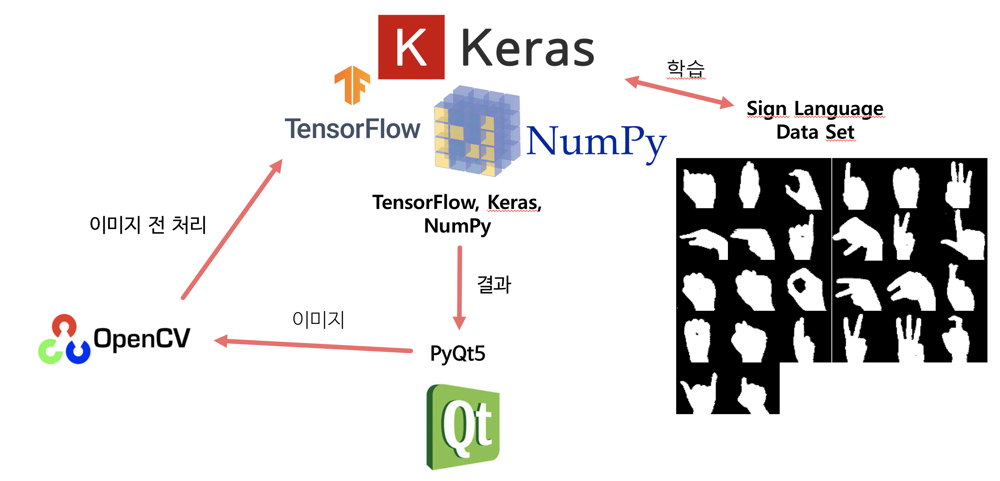
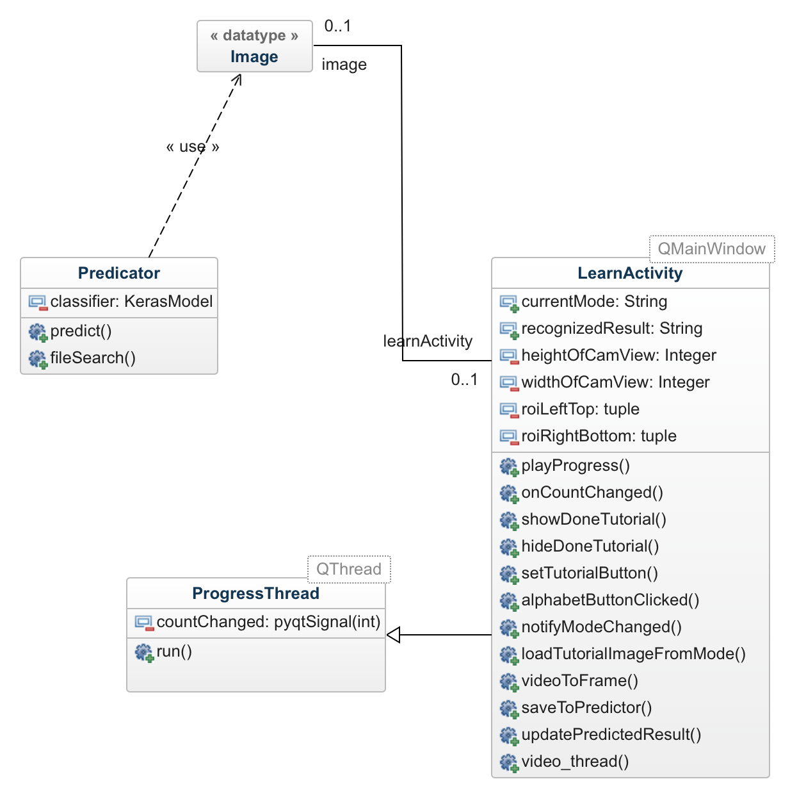

# 소프트웨어구조설계서(ADS)

## 전체 인프라 다이어그램

  
- **Keras** 를 이용하여 딥러닝 모델(CNN) 구축
- 수화를 인식 시키키위한 학습 데이터는 **Sign Langage DataSet** 이용
- Pyqt GUI 에서는 이미지를 **OpenCV를 활용하여 전처리**를 한후 이를 딥러닝 모델에 Feed 해줌
- 딥러닝 모델은 이를 분석 헤서 다시 메인 GUI 에 넘겨줌

## 클래스 다이어그램

  
- **LearnActivity** 는 QMainWindow를 상속받으며 **메인 GUI와 로직**을 담당함.
- **Predicator** 는 LearnActivity 와 **Dependency 를 가지지 않으며** Image 를 읽어 들여 수화 **제스쳐를 인식**하는 역할을 함
- **ProgressThread** 는 인식률을 보여주는 ProgressBar 로직을 처리함
- **Image**는 단순 독립적인 png 이미지 파일로서 **LearnActivity.saveToPredicator()** 함수가 이를 저장 하고 **Predicator** 이를 인식함.
