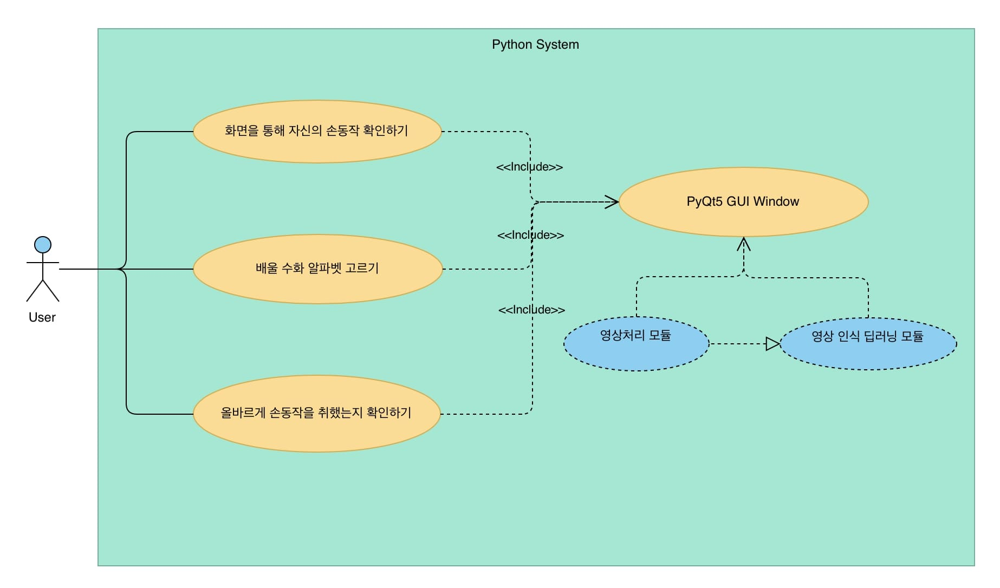
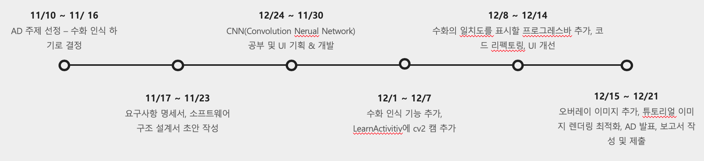

# 요구 사항 명세서 (SRS)

## 시스템 개요

전 세계 인구 대비 청각 장애인 비율은 5%입니다. 이 5%를 다르게 해석하면 20명 중에 1명은 청각 장애인 이라는 말이 됩니다.
또 65세이상 노인중 3명중 1명은 청각 장애를 가지고 있습니다. 청각 장애가 있으신 분들과 대화 하기 위해서는
수화라는 시각적 의사소통 방법을 사용하게 됩니다. 하지만 정작 일반인들은 수화를 잘 알지 못합니다.
또한 수화를 배우려고 시도해도 내가 올바른 수화를 하고 있는건지 잘 알 수가 없습니다.
이러한 불편함에서 저희는 사용자의 손 모양을 인식해 올바른 수화를 재밌고 쉽게 배울 수 있게끔 불편함을 해결하고자
'EasyHandy'라는 프로그램을 제작하게 되었습니다.
 
 
EasyHandy에서는 배우고 싶은 알파벳을 클릭하고, 실행화면에 보이는 오버레이 이미지 위에 손을 가져다 두면 
올바른 수화를 했는지 사용자가 알 수 있게 됩니다. 사용자와 상호작용하는 UI를 통해 사용자는 수화를 배우는데 
흥미를 느끼고, 수화 인식 모듈의 정확한 인식률에 사용자는 수화를 제대로 배울 수 있을 것입니다.

Use Cases Diagram

## 1. 기능적 요구사항

| UC-01 | 화면을 통해 자신의 손동작 확인하기 | 
|:-------:|:------:|
|   설명     |   사용자는 자신의 취한 손동작을 화면내 UI 로 확인할 수 있어야 한다 (Mirror)  |
|   행위자    |   사용자   |
|   선행조건  |   프로그램을 켜야한다, 웹캠이 켜져 있어야 한다    |
|   기본동작  |   1. 프로그램을 킨다.  2. 아무 수화(손동작) 를 취한다.   3. 웹캠을 통해 들어온 영상을 실시간으로 사용자에게 보여준다.    |
     
    
| UC-02 | 수화로 배울 알파벳 고르기 | 
|:-------:|:------:|
|   설명     |   사용자는 자신이 배우고 싶은 알파벳을 사용자 인터페이스에서 클릭 할 수 있다.  |
|   행위자    |   사용자   |
|   선행조건  |   프로그램을 켜야한다.     |
|   기본동작  |   1. 프로그램을 킨다.  2. 배우고 싶은 알파벳을 클릭한다. |
  
 
| UC-03 | 올바르게 손동작을 취했는지 확인하기 | 
|:-------:|:------:|
|   설명     |   사용자가 취한 손동작을 이미지로 저장해서 사용자가 배우고 싶은 알파벳과 비교해서 사용자에게 결과를 알려준다.  |
|   행위자    |   사용자   |
|   선행조건  |   프로그램을 켜야한다, 웹캠이 켜져 있어야 한다. 수화로 배울 알파벳을 골라야된다. 사용자가 자신이 배우기로 선택한 수화의 손동작을 취해야 한다.    |
|   기본동작  |   1. 프로그램을 킨다.  2. 아무 수화(손동작) 를 취한다.   3. 사용자의 수화가 맞는지 확인하고 이에 대한 결과를 사용자에게 알려준다.    |

1. 제스쳐 인식
    1. 제스쳐 인식 모듈은 주변 환경이 달라지더라도 손을 인식할 수 있어야 한다.
    1. 제스쳐 인식 모듈은 카메라의 각도가 달라지더라도 손을 인식할 수 있어야 한다.
    1. 제스쳐 인식 모듈은 극단적인 환경변화 같은 요인으로 인식이 안될경우를 대비해 Offset(필터 설정값)을 실시간으로 반영하여 인식률을 높일 수 있어야 한다.
    1. 제스쳐 인식 모듈은 새로운 제스쳐를 인식할 수 있어야 한다.

2. 이미지 처리
    1. 이미지 처리는 최소한 1초에 10번은 진행되어야 한다.
    1. 이미지는 이진화(HSV)를 한다음에 이미지 분석 모듈에 전달되어야 된다.
    
3. 제스쳐 인식 결과
    1. 사용자의 제스쳐가 맞았다면 화면에 인식률 프로그레스바의 값을 증가시켜야 된다.
    1. 제스쳐가 인식 되지 않았을 때는 .를 리턴해야 된다. 
    
4. 영상 처리
    1. OpenCV를 이용하여 사용자의 카메라를 인식한후 영상데이터를 받아와야한다.
    1. 영상데이터는 좌우 반전이 되어있기 때문에 이를 원래대로 다시 반전 시켜야 한다.
    1. 영상의 각 프레임을 저장하여 딥러닝 모델로 하여금 인식시킬수 있도록 해야한다.
    1. 사용자에게 보여질 영상내에는 사각형모양의 ROI를 Overlay 하여 사용자가 이 안에 손동작을 취할 수 있도록 유도해야한다.
    1. 프레임의 끊김이 없이 원활하게 처리해야한다.
    
## 2. 사용자 인터페이스 요구사항

1. 하드웨어는 개인 컴퓨터의 **웹캠** 을 이용하여 인식할 수 있어야 한다.
1. 사용자는 카메라 실행화면에 나타나는 지정된 위치에 손을 놔야된다.
1. 사용자 인터페이스를 구성하는 요소는 다음과 같다.
    1. 인터페이스는 한개의 창으로 표시되어야 한다.
    2. 사용자의 손 동작을 보여주는 카메라 실행화면이 있어야된다.
    3. 사용자의 손을 인식한 결과를 표시해주어야 한다.
    4. 현재 배우고 있는 수화의 인식 진행률을 표시해 주어야 한다.
    5. 사용자의 손을 인식할 영역을 사용자가 알도록 카메라 실행화면에 영역을 표시해 주어야 한다.
    6. 사용자가 배울려고하는 알파벳들의 수화 모양을 손을 인식하는 영역에 오버레이 해야 한다.
    
## 3. 비기능적 요구사항

1. 이 소프트웨어의 구현에는 Pyhton3, OpenCV3, Tensorflow, Keras 를 이용한다.
2. 

## 프로젝트 수행 일정

